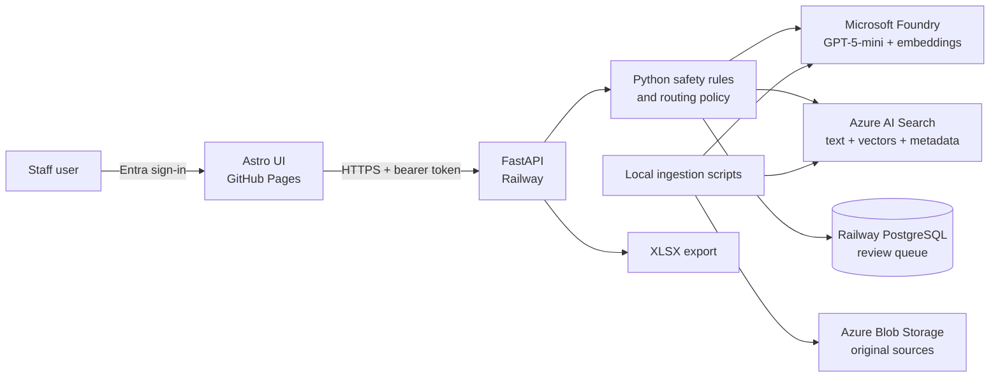
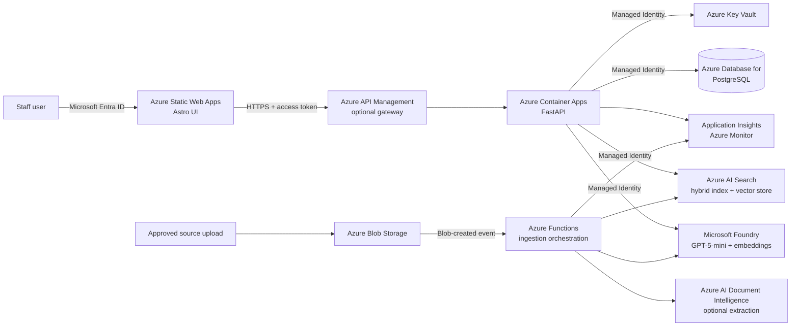
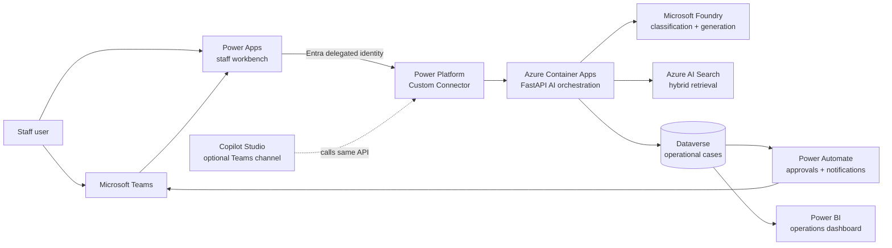

# Architecture options: current, Azure-native, and Power Platform

## Purpose

This document compares three valid deployment models for Agentic Support
Intelligence:

1. the architecture deployed today;
2. a fully Azure-native architecture; and
3. Azure AI engineering with a Power Platform operating layer.

The classification, deterministic routing, category-filtered retrieval,
grounded generation, and citation validation remain the authoritative AI flow
in every option.

## Option 1: current deployed architecture



### Responsibilities

| Component | Responsibility |
| --- | --- |
| GitHub Pages | Public case study, enquiry workbench, and protected staff UI |
| Railway FastAPI | Validation, sensitive rules, classification orchestration, routing, RAG, and citation checks |
| Railway PostgreSQL | Persist authenticated staff enquiries and review status |
| Microsoft Entra ID | Staff authentication and delegated API scope |
| Microsoft Foundry | `gpt-5-mini` classification/generation and `text-embedding-3-small` embeddings |
| Azure AI Search | Chunk text, vectors, metadata, filters, BM25, HNSW, and RRF |
| Azure Blob Storage | Approved original source documents and provenance |
| Local Python pipeline | Registration, extraction, chunking, embedding, validation, and indexing |

### Why it is appropriate now

- It reuses the existing portfolio and Railway account.
- It exposes the pro-code AI decisions clearly.
- It keeps operating cost and migration work limited.
- Its main weakness is split operations across GitHub, Railway, Azure, and the
  local ingestion environment.

## Option 2: fully Azure-native architecture



### Microsoft replacements

| Current component | Azure-native replacement |
| --- | --- |
| GitHub Pages | Azure Static Web Apps |
| Railway FastAPI | Azure Container Apps |
| Railway PostgreSQL | Azure Database for PostgreSQL Flexible Server |
| Service-principal secret | System-assigned Managed Identity |
| Railway secrets | Azure Key Vault references |
| Manual local ingestion | Blob-triggered Azure Functions |
| Local PDF extraction | Azure AI Document Intelligence, where layout/table extraction adds value |
| Railway logs | Application Insights and Azure Monitor |
| Manual infrastructure | Azure Bicep |

### Advantages

- Managed Identity removes the application secret used by the hosted backend.
- Azure RBAC provides one control plane for Foundry, Search, Storage, Key Vault,
  and the database.
- Blob events can start an asynchronous ingestion pipeline.
- Monitoring and deployment are consolidated in Azure.

### Trade-offs

- More Azure resources, configuration, and cost.
- Azure Static Web Apps duplicates the existing public portfolio hosting.
- Cloud ingestion requires stronger upload validation, malware controls,
  idempotency, retries, index versioning, and operator approval.
- It improves platform integration more than it improves the underlying RAG
  algorithm.

## Option 3: Azure plus Power Platform



### Power Platform equivalents

| Requirement | Power Platform component |
| --- | --- |
| Internal staff workbench | Power Apps Canvas App or model-driven app |
| Operational case store | Microsoft Dataverse |
| API integration | Entra-authenticated Custom Connector generated from OpenAPI |
| Review and approval workflow | Power Automate |
| Teams notification | Power Automate Teams connector or Adaptive Card |
| Management reporting | Power BI over Dataverse |
| External authenticated portal | Power Pages, if an external portal is genuinely required |
| Conversational channel | Copilot Studio, optionally published to Teams |

### Recommended division of responsibility

```text
Power Apps / Teams
    Staff experience and case review

Power Automate
    Notifications, approvals, reminders, and assignments

Dataverse
    Operational case records and role-based business data

FastAPI on Azure
    Deterministic safety controls and AI orchestration

Microsoft Foundry + Azure AI Search
    Classification, embeddings, retrieval, and grounded generation
```

The Power Platform layer should call the same protected FastAPI API. It should
not reimplement the sensitive-routing policy in a flow, because that would
create two safety implementations that could diverge.

## Side-by-side comparison

| Concern | Current | Azure-native | Azure + Power Platform |
| --- | --- | --- | --- |
| Public portfolio | GitHub Pages | Static Web Apps | Static Web Apps or keep GitHub Pages |
| Staff UI | Custom Astro | Custom Astro | Power Apps or Teams tab |
| API compute | Railway | Container Apps | Container Apps |
| Case database | Railway PostgreSQL | Azure PostgreSQL | Dataverse |
| Staff workflows | Custom queue | Custom queue | Power Automate |
| AI control | Full pro-code control | Full pro-code control | Full control retained in Azure API |
| Backend identity | Service principal | Managed Identity | Managed Identity + delegated connector identity |
| Ingestion | Local scripts | Functions + Blob events | Functions; Power Apps may provide upload/review UI |
| Monitoring | Railway logs | Azure Monitor | Azure Monitor + Power Platform analytics |
| Main strength | Low cost and portfolio fit | Azure engineering depth | Microsoft business-process integration |
| Main risk | Split platforms | Cost and complexity | Licensing and hidden low-code complexity |

## Should Copilot Studio be used?

### Use it when

- the organisation wants the experience inside Microsoft Teams;
- staff already work primarily through Microsoft 365;
- conversational, multi-turn access is more useful than a case-management
  screen; and
- licensing and tenant administration are available.

### Do not make it the core when

- the portfolio needs to demonstrate retrieval algorithms and evaluation;
- deterministic routing and exact citation validation must remain visible;
- the public demo must work without organisational Microsoft licensing; or
- Copilot Studio would duplicate the existing classification and generation
  orchestration.

The recommended pattern is to keep FastAPI as the authoritative AI service and
let Copilot Studio call it through an authenticated connector. Copilot Studio
can also use Azure AI Search as a custom knowledge source, but doing so would
create a second retrieval path unless the existing API contract is deliberately
replaced.

## Teams access options

### 1. Power Apps as a Teams tab — recommended for case work

Embed the staff review application as a Teams tab. This provides filters,
status changes, assignments, evidence inspection, and approvals in a structured
interface.

### 2. Power Automate Adaptive Cards — recommended for notifications

When an enquiry needs review, post an Adaptive Card to a team or reviewer with
the summary, route, sensitivity status, and a link to the case. Keep sensitive
text out of broad channels.

### 3. Copilot Studio agent in Teams — optional conversational access

Publish a Copilot Studio agent to Teams and have it call the protected API. It
is useful for asking questions and opening cases, but it should not replace the
structured review queue.

### 4. Teams personal app wrapping the custom web UI

Package the existing web interface as a Teams personal tab. This preserves the
Astro/FastAPI implementation while adding a Teams entry point, but requires a
Teams app manifest and production hosting accepted by the tenant.

## Recommendation

Keep the current architecture for the public portfolio. If extending it for an
enterprise demonstration, migrate Railway FastAPI to Azure Container Apps and
replace the client secret with Managed Identity first. Then add a small Power
Apps or Teams review experience backed by the same API. Add Copilot Studio only
as an optional Teams channel, not as a replacement for the evaluated RAG and
safety pipeline.

## Microsoft references

- [Azure Static Web Apps authentication](https://learn.microsoft.com/azure/static-web-apps/authentication-authorization)
- [Azure Container Apps managed identities](https://learn.microsoft.com/azure/container-apps/managed-identity)
- [Azure Functions Blob trigger](https://learn.microsoft.com/azure/azure-functions/functions-bindings-storage-blob)
- [Power Platform custom connector with Entra ID](https://learn.microsoft.com/connectors/custom-connectors/azure-active-directory-authentication)
- [Power Automate approvals from Microsoft Lists](https://learn.microsoft.com/power-automate/trigger-sharepoint-list)
- [Copilot Studio custom knowledge sources](https://learn.microsoft.com/microsoft-copilot-studio/guidance/custom-knowledge-sources)
