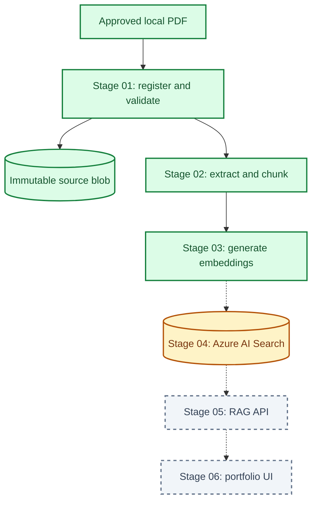
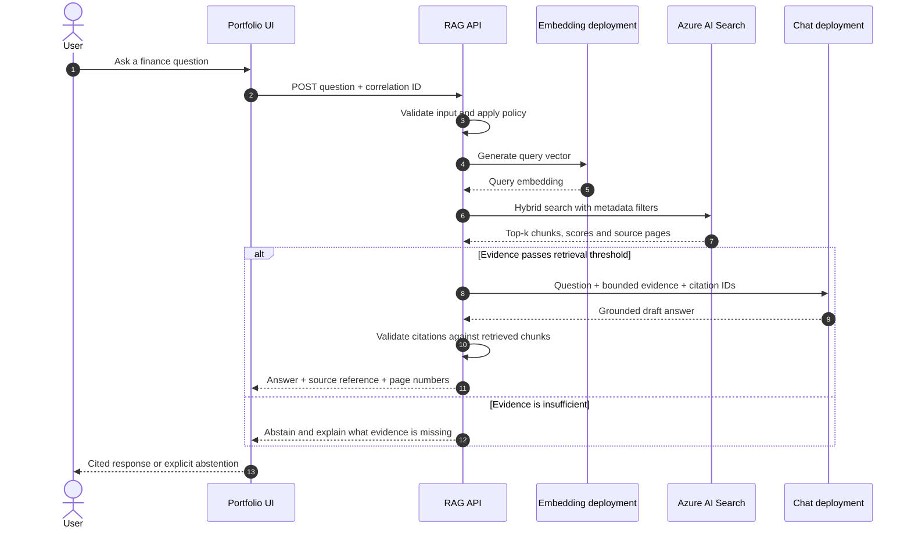

# Project architecture

## Executive summary

This project uses a **modular classic RAG architecture on Azure**. The offline
pipeline turns operator-approved financial PDFs into traceable chunks and
embeddings. The planned online pipeline retrieves that evidence and asks the
chat model to produce cited answers or abstain.

Source acquisition is deliberately outside the application boundary. An
operator places a PDF directly in `data/sources/` and records its provenance and
usage basis. A URL is optional metadata; the application neither downloads nor
trusts a document merely because it is publicly reachable.

The diagrams use these implementation states:

- **Implemented**: code exists in this repository.
- **Provisioned**: the Azure resource exists, but application integration is
  not complete.
- **Planned**: target capability not yet implemented.

Status describes repository progress, not live Azure health.

## Logical architecture

### System map

This diagram stays vertical and shows only the main lifecycle. Detailed service
responsibilities follow in a table instead of being compressed into the same
canvas.



Solid arrows are implemented data movement. Dashed arrows are the next or later
integrations.

### Implemented offline path

This second diagram expands only the implemented part, including the two Azure
calls. Keeping the future serving path separate prevents GitHub from shrinking
the labels.


### Component responsibilities

| Component | Responsibility | Status |
| --- | --- | --- |
| `source-documents` | Preserve verified original PDFs with immutable names. | Implemented |
| `processed-documents` | Store processed pipeline artifacts in Azure. | Provisioned |
| Embedding deployment | Convert chunk and later query text into vectors. | Implemented |
| Azure AI Search | Hold the versioned hybrid retrieval index. | Provisioned; integration next |
| Chat deployment | Synthesize an answer from bounded retrieved evidence. | Provisioned |
| RAG API and UI | Apply retrieval, citation, and abstention policies. | Planned |
| `evaluation-data` | Store evaluation datasets and run results. | Provisioned |
| Evaluation and telemetry | Measure quality, latency, failures, and cost. | Planned |

## Offline ingestion path

The local ingestion path is explicit and reproducible:

1. The operator places a PDF in `data/sources/`. How the operator received it
   is outside this application's scope.
2. `scripts.stage_01_ingestion.register_source_pdf` validates the local file
   and creates an ignored JSON sidecar containing a stable document ID,
   provenance, usage basis, rights note, size, SHA-256, and immutable blob name.
3. `scripts.stage_01_ingestion.upload_source_blob` verifies the PDF against its
   sidecar, refuses to overwrite a different blob, and downloads the stored
   object to verify its bytes and SHA-256. Re-running it against an identical
   blob is safe.
4. `scripts.stage_02_processing.extract_pdf_text` verifies the source again,
   extracts page-level text, and records extractor version, page hashes,
   normalisation rules, and an extraction-coverage quality gate.
5. `scripts.stage_02_processing.chunk_extracted_text` creates stable,
   page-bounded chunk identifiers. Each result can cite a physical PDF page.
6. `scripts.stage_03_embeddings.generate_embeddings` validates all chunks,
   batches their text through the Foundry embedding deployment, and rejects
   incorrectly sized vectors.

Raw PDFs, sidecars, and generated JSON remain outside Git. Scripts and schema
documentation are committed; content stays local and in controlled Azure
containers.

## Online request path (target)



The model is not the source of truth. Search returns evidence, the chat model
synthesises only from that evidence, and the API validates citation IDs before
returning the response.

## Trust boundaries and identity

| Context | Authentication | Authorisation target |
| --- | --- | --- |
| Local development | `InteractiveBrowserCredential` in the configured tenant | Least-privilege Azure RBAC roles |
| Deployed application | Managed identity | Blob, Search, and Foundry data-plane roles |
| Git repository | No Azure credentials or document content | Templates, code, and non-secret resource names only |

Storage keys, search admin keys, connection strings, SAS tokens, access tokens,
and client secrets are not part of the intended application path. Tenant
Security Defaults remain enabled.

## Data contracts and traceability

```text
operator approval + source reference
  -> local PDF SHA-256 + metadata sidecar
  -> immutable source blob
  -> page number + page-text SHA-256
  -> deterministic chunk ID + chunk-text SHA-256
  -> embedding record
  -> search result
  -> answer citation
```

Important controls include:

- source files restricted to `data/sources/`, with symlinks rejected;
- format-header, size, metadata, and SHA-256 validation at stage boundaries;
- immutable blob names and overwrite protection;
- versioned source and processed-document schemas;
- deterministic, page-bounded chunks;
- provenance and rights notes carried into processed artifacts;
- explicit vector-dimension validation;
- a versioned search index name for safe schema evolution.

`source_url` is nullable and retained only for provenance. It is not used for
download or as proof of permission. The operator remains responsible for
confirming that processing and any displayed excerpts are allowed.

See
[processed-document-schema.md](../stage_02_processing/processed-document-schema.md)
for the extraction contract,
[source-metadata-schema.md](../stage_01_ingestion/source-metadata-schema.md) for
the registration contract, and
[source-ingestion.md](../stage_01_ingestion/source-ingestion.md) for the
executable workflow.

## Retrieval and answer policy

The target uses hybrid retrieval:

- keyword search preserves exact financial terms, dates, and account names;
- vector search captures semantically related language;
- metadata filters can exclude historical documents;
- semantic reranking can be measured separately from the baseline;
- an evidence threshold triggers abstention when the corpus is insufficient.

The API must constrain context size, validate citation identifiers, and expose
the source reference and physical page number. A source URL is shown only when
one was recorded.

## Evaluation strategy

The `evaluation-data` container will hold versioned questions, expected
evidence, and run results.

| Layer | Example measures |
| --- | --- |
| Ingestion | source hash match, extraction coverage, empty-page rate |
| Retrieval | Recall@k, MRR, nDCG, source/page match |
| Generation | groundedness, citation correctness, answer relevance, abstention quality |
| Operations | p50/p95 latency, request failures, token usage, estimated cost |

Each run should record corpus version, index version, embedding deployment,
retrieval settings, prompt version, and chat deployment.

## Delivery roadmap

1. **Implemented foundation**: controlled local registration, verified Blob
   upload, extraction, deterministic chunking, and embedding generation.
2. **Retrieval MVP**: define the Azure AI Search schema, upload vectors, and
   verify keyword, vector, and hybrid retrieval from Python.
3. **Grounded answer MVP**: add the RAG orchestrator, citations, evidence
   thresholds, and explicit abstention.
4. **Evaluation**: create an expert-reviewed dataset and establish retrieval
   baselines before prompt tuning.
5. **Serving and operations**: expose an authenticated API and portfolio UI,
   deploy with managed identity, and add telemetry and cost monitoring.
