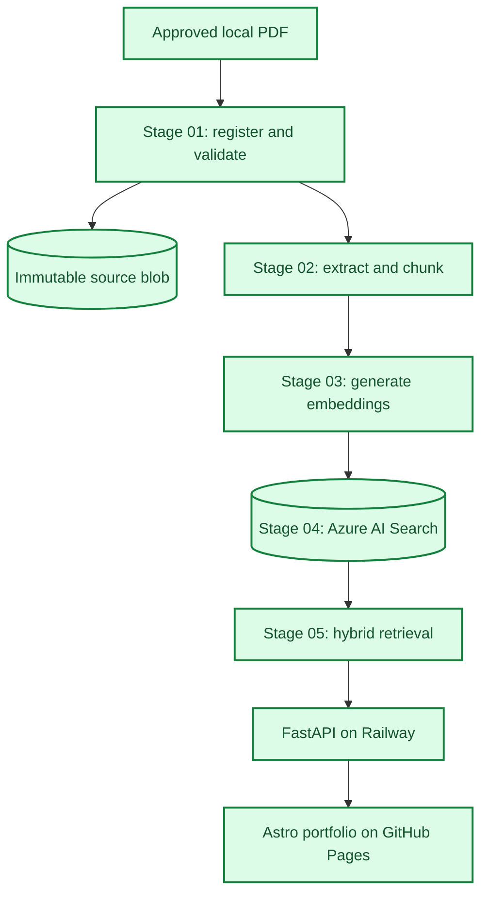
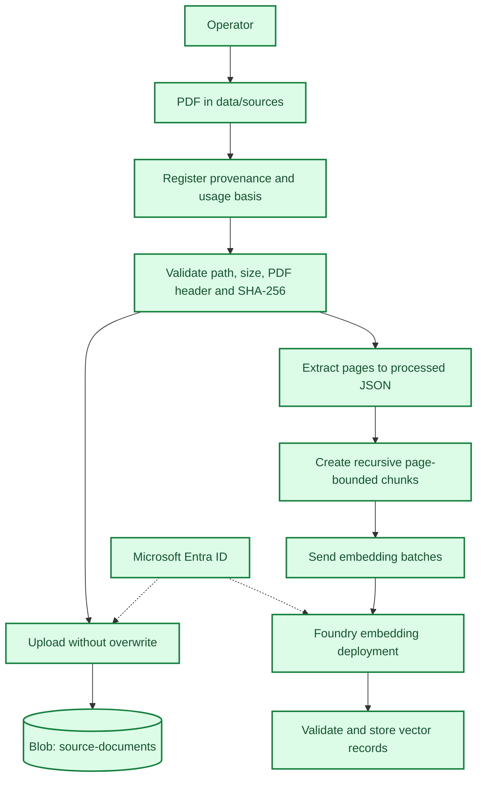
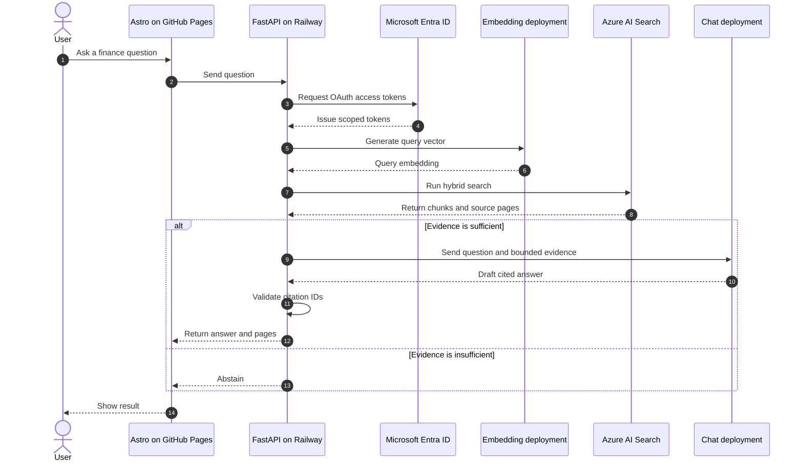

# Project architecture

## Scope

This project uses modular classic RAG on Azure. The offline pipeline turns
approved financial PDFs into traceable vectors. A FastAPI serving layer returns
a cited answer or abstains, and the existing Astro portfolio provides the UI.

Source acquisition is outside the application boundary. An operator places a
PDF in `data/sources/`; a URL is optional provenance, not a download input or
proof of permission.

| Status | Meaning |
| --- | --- |
| Implemented | Code exists in this repository. |
| Provisioned | Azure resource exists; integration may be incomplete. |
| Planned | Target capability not yet implemented. |

## System map



All shown components are implemented in code. Railway deployment and the
portfolio API URL remain operator deployment steps.

## Implemented offline path



Use the [source ingestion guide](../stage_01_ingestion/source-ingestion.md) for
commands. Data contracts are defined by the
[source metadata](../stage_01_ingestion/source-metadata-schema.md) and
[processed document](../stage_02_processing/processed-document-schema.md)
schemas. The [chunking strategy](../stage_02_processing/chunking-strategy.md)
records the retrieval-unit decision and comparison.

## Component status

| Component | Responsibility | Status |
| --- | --- | --- |
| `source-documents` | Preserve verified original PDFs. | Implemented |
| `processed-documents` | Store processed artifacts in Azure. | Provisioned |
| Embedding deployment | Convert text into vectors. | Implemented |
| Azure AI Search | Store the hybrid retrieval index. | Implemented |
| Hybrid retrieval | Combine BM25 and vector evidence rankings. | Implemented |
| Chat deployment | Synthesize answers from bounded evidence. | Implemented |
| Grounded answer CLI | Generate, cite, validate, and abstain. | Implemented |
| FastAPI serving layer | Serve documents, cited answers, and abstentions. | Implemented |
| Astro portfolio UI | Present evidence and call the API without Azure secrets. | Implemented |
| `evaluation-data` | Store evaluation inputs and results. | Provisioned |
| Retrieval evaluation | Measure Recall@k and MRR on reviewed questions. | Implemented |
| Positive generation evaluation | Measure answers, citations, and token usage. | Implemented |
| Abstention evaluation | Measure unanswerable questions and false answers. | Implemented |
| Serving telemetry | Measure public API latency, failures, and cost. | Planned |

## Online request path



The API also maps cited chunks to official PDF links and page anchors through a
tracked public document catalog.

## Security and traceability

| Context | Identity |
| --- | --- |
| Local development | Device code or browser credential with least-privilege RBAC |
| Railway application | Entra ID service principal with data-plane RBAC |
| Future Azure-hosted application | Managed identity with data-plane RBAC |
| Git | No credentials or document content |

```text
operator approval
  -> PDF SHA-256 + source metadata
  -> immutable source blob
  -> page hash
  -> chunk ID + chunk hash
  -> embedding record
  -> search result
  -> citation
```

Controls: restricted source paths, symlink rejection, file and hash validation,
overwrite protection, deterministic chunk IDs, vector-size checks, versioned
schemas, a public-document allowlist, CORS, input limits, request throttling,
and a live-generation kill switch. The operator is responsible for usage and
redistribution rights.

## Evaluation targets

| Layer | Measures |
| --- | --- |
| Ingestion | Hash match, extraction coverage, empty-page rate |
| Retrieval | Recall@k, MRR, nDCG, source/page match |
| Generation | Groundedness, citation correctness, abstention quality |
| Operations | p50/p95 latency, failures, tokens, estimated cost |

Each run should record corpus, index, model, retrieval, and prompt versions.

## Roadmap

1. Deploy FastAPI to Railway and configure its Entra ID service principal.
2. Publish the portfolio with `PUBLIC_UOL_FINANCE_API_URL`.
3. Add persistent rate limiting, telemetry, and cost dashboards.
4. Add an authenticated PDF/URL ingestion interface with security review.
