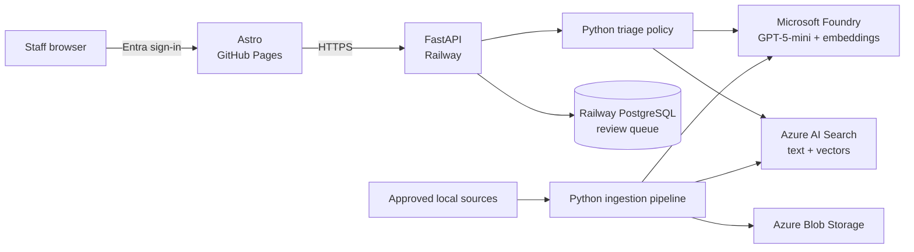

# Project architecture

Agentic Support Intelligence is a staff-facing enquiry-triage system. It
classifies an enquiry, applies deterministic safety policy, and creates a cited
draft only when the category is supported and the request is complete.

## Deployed system

| Area | Current implementation |
| --- | --- |
| Frontend | Astro case study, live workbench and staff queue on GitHub Pages |
| API | FastAPI on Railway |
| Identity | Microsoft Entra ID for staff and Azure service access |
| AI | GPT-5-mini and `text-embedding-3-small` in Microsoft Foundry |
| Retrieval | Hybrid BM25 + vector search in Azure AI Search |
| Persistence | Railway PostgreSQL plus protected XLSX export |
| Source storage | Azure Blob Storage |
| Ingestion | Operator-run local Python stages |

## Boundaries

- The public demo accepts synthetic enquiries only.
- Source acquisition and approval happen before ingestion.
- Only four indexed categories may enter RAG.
- Sensitive, unsupported and incomplete enquiries cannot generate drafts.
- All generated answers are drafts requiring staff review.
- Source documents, extracted text, chunks and vectors remain outside Git.

## Detailed documentation

- [Corpus and routing boundaries](corpus-and-routing.md)
- [Source ingestion](../stage_01_ingestion/source-ingestion.md)
- [Embedding generation](../stage_03_embeddings/embedding-generation.md)
- [Index schema](../stage_04_search_index/index-schema.md)
- [Hybrid retrieval](../stage_05_retrieval/hybrid-retrieval.md)
- [Enquiry triage](../stage_06_triage/enquiry-triage.md)
- [API and portfolio](../stage_07_serving/api-and-portfolio.md)
- [Azure resources](../stage_00_environment/azure-resources.md)

## Current gaps

Production use still requires institutional policy review, independent domain
validation, persistent distributed rate limiting, operational telemetry,
retention controls and an approved ingestion interface.
