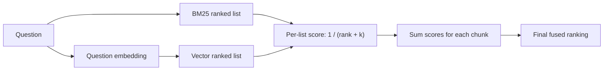

# Hybrid retrieval

## Purpose

Stage 05 retrieves grounded evidence before answer generation. It combines two
signals because financial questions can need both exact terms and semantic
meaning.

| Signal | Input | Strength |
| --- | --- | --- |
| BM25 | Original question text | Exact names, dates, and financial terms |
| Vector | 1,536-value question embedding | Similar meaning with different wording |

Azure AI Search combines both rankings with Reciprocal Rank Fusion (RRF). Its
score orders results; it is not an answer-confidence probability. Chat
generation is kept out of this stage so retrieval quality can be inspected
independently.

## RRF flow

In the formula, the denominator is `rank + k`; Microsoft documents `k` as an
RRF constant and gives 60 as an effective value. This `k` is separate from the
number of vector neighbours. A chunk appearing high in both lists receives
contributions from both and moves upward.

RRF and hybrid retrieval are not unique to Azure. Azure's advantage is managed
execution of keyword and vector queries plus fusion in one search request.
Other systems, including Elasticsearch, also implement RRF, and an application
can implement the fusion itself.

Vector-only retrieval in this project means embedding similarity without BM25.
It is not Azure AI Search's optional Semantic Ranker feature.

## Request flow

1. Validate the question and result limits.
2. Embed the question with `text-embedding-3-small`, matching Stage 03.
3. Search `text`, `source_title`, and `institution` while querying
   `content_vector` in the same request.
4. Return the top chunks with page and source metadata.
5. Exclude `content_vector` from the selected fields.

Implementation:
[`hybrid_search.py`](../../scripts/stage_05_retrieval/hybrid_search.py).

## Current boundary

Implemented: query embedding, hybrid retrieval, optional document filter, safe
field selection, and evidence output.

The initial reviewed dataset and Recall@k/MRR baseline are documented in
[retrieval evaluation](./retrieval-evaluation.md). Grounded generation is
documented in [grounded answer generation](./grounded-answer-generation.md).

## References

- [Hybrid search overview](https://learn.microsoft.com/azure/search/hybrid-search-overview)
- [Azure RRF ranking](https://learn.microsoft.com/azure/search/hybrid-search-ranking)
- [Create a hybrid query](https://learn.microsoft.com/azure/search/hybrid-search-how-to-query)
- [Elasticsearch RRF](https://www.elastic.co/docs/reference/elasticsearch/rest-apis/reciprocal-rank-fusion)
