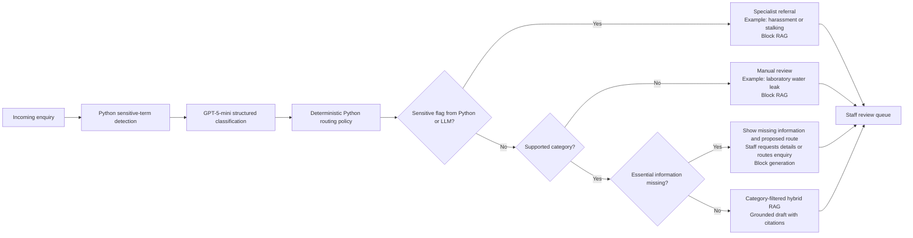

# Enquiry triage and safe routing

The user is a staff member handling an incoming enquiry. The person who sent
the original email never interacts with the demo directly.

## Decision flow

The LLM returns a typed classification: `category`, `subcategory`,
`is_sensitive`, proposed `action`, `route_to`, `missing_info`, and a short
summary. `routing_policy.py` then makes the final decision in code. A sensitive
decision always sets `allow_generation=false`, so the model never receives
retrieved context with which to draft a response.

The classifier has five category values: four approved RAG domains plus
`unsupported`. The latter is a control value rather than a knowledge corpus.
Sensitivity and missing information are separate fields, so neither
`student_support` nor `unclear` is needed as a category. Python blocks retrieval
for unsupported and sensitive enquiries.

The sensitive-term scan runs first inside FastAPI on Railway, but the current
implementation still sends the enquiry to GPT-5-mini for classification. The
routing policy then combines the retained rule flags with the LLM result. A
sensitive result stops calls 2–4: no query embedding, retrieval, or draft
generation occurs.

Azure AI Search stores both chunk text and vectors. Citations originate from
the returned chunks' `source_title`, `source_url`, `page_number`, and text
metadata. FastAPI assigns allowed IDs such as `S1`; GPT-5-mini may cite only
those IDs, and FastAPI validates them before returning the response.

## Files

| File | Responsibility |
| --- | --- |
| `schemas.py` | Validated classification and decision contracts |
| `sensitive_rules.py` | Conservative first-layer safety flags |
| `classify_enquiry.py` | Structured classification with `gpt-5-mini` |
| `routing_policy.py` | Deterministic final action and route |
| `triage_enquiry.py` | Orchestrates classification and approved RAG |
| `evaluate_triage.py` | Measures the 21-case reviewed dataset |

## Evaluation

The canonical report combines retrieval results with the expanded 21-case
triage and safety evaluation:
[System evaluation](../stage_05_retrieval/retrieval-evaluation.md).

The dataset contains synthetic enquiries only. Do not enter real personal or
sensitive correspondence in the portfolio demo.
