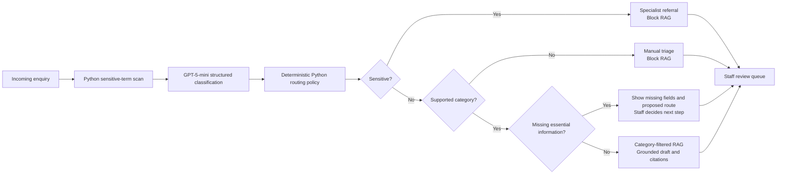

# Enquiry triage

This staff-facing pipeline converts one unstructured enquiry into a controlled
action and route. It never sends a response automatically.

## Flow

## Execution order

1. [`sensitive_rules.py`](../../scripts/stage_06_triage/sensitive_rules.py)
   records conservative sensitive-term flags.
2. [`classify_enquiry.py`](../../scripts/stage_06_triage/classify_enquiry.py)
   sends the original enquiry to GPT-5-mini and receives structured output.
3. [`schemas.py`](../../scripts/stage_06_triage/schemas.py) validates the
   controlled fields and enum values.
4. [`routing_policy.py`](../../scripts/stage_06_triage/routing_policy.py)
   applies the final decision in Python.
5. [`triage_enquiry.py`](../../scripts/stage_06_triage/triage_enquiry.py) runs
   RAG only when the final policy permits it.

## Four outcomes

| Example | Final outcome |
| --- | --- |
| Harassment or stalking | Specialist referral; no RAG |
| Laboratory water leak | Unsupported; manual triage; no RAG |
| Incomplete Minerva issue | Staff requests details or routes it; no generation |
| Complete expense question | Cited draft from approved evidence |

The LLM proposes a classification and route. Python decides whether retrieval
and generation are allowed. Every result enters a staff review queue; the
original sender does not interact with the demo.

## Read next

1. [Classification contract](classification-contract.md): first Azure call,
   five categories, structured output and validation.
2. [Routing and safety policy](routing-policy.md): precedence, actions, routes
   and generation gates.
3. [Triage evaluation](triage-evaluation.md): classification, routing and
   generation-safety metrics.
4. [API and portfolio](../stage_07_serving/api-and-portfolio.md): authentication,
   persistence and Staff UI.
